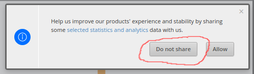
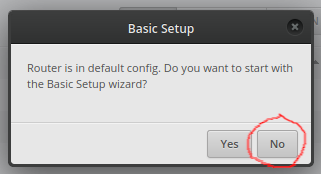
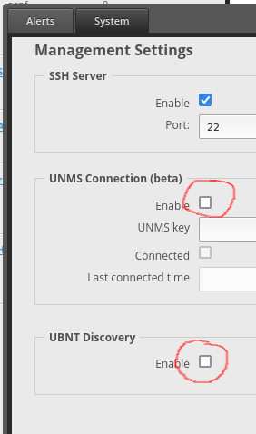
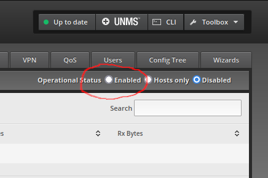
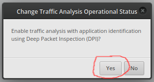
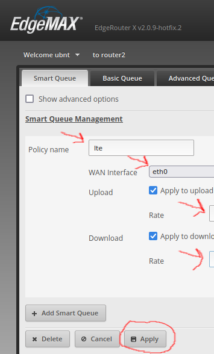

OpenWRT
=======

EdgeRouter X
------------

* http://sector5d.org/openwrt-on-the-ubiquiti-edgerouter-x.html
* http://www.makikiweb.com/ipv6/edgerouterx_openwrt.html
* https://www.reddit.com/r/openwrt/comments/x1grtz/proscons_of_openwrt_on_ubiquiti_edgerouter_x/
* https://www.reddit.com/r/openwrt/comments/nejwp6/openwrt_on_edgerouterx_advantage/
* https://openwrt.org/toh/ubiquiti/edgerouter_x_er-x_ka
* https://openwrt.org/inbox/toh/ubiquiti/ubiquiti_edgerouter_x_er-x_ka
* https://openwrt.org/docs/techref/hardware/switch

UniFi Accesspoints
------------------

* https://blog.christophersmart.com/2021/10/02/flashing-openwrt-onto-ubiquiti-unifi-ap-ac/
* https://openwrt.org/toh/ubiquiti/unifiac
* https://openwrt.org/toh/ubiquiti/unifi_ap

DHCP Server
-----------

::

    Router 172.23.0.1
    Subnet 172.23.0.0/24
    Range start 172.23.0.51
    Range stop 172.23.0.150

Stock Ubiquiti Firmware
=======================

Factory Reset EdgeRouter X
~~~~~~~~~~~~~~~~~~~~~~~~~~

#. Boot router with "factory defaults" (refer to "quick start guide";  eth1 will DHCP and give eth0 24V).
#. Login to the web UI with "ubnt:ubnt".
#. Make sure the firmware is up-to-date.
#. Decline to send data to Ubiquiti and skip starting any wizards for now.
#. Set the hostname, disable "UNMS Connection (beta)" and "UBNT Discovery".
#. Login via SSH and install wireguard-vyatta-ubnt.  STOP HERE IF PREPPING A SPARE ROUTER.  (See below.)
#. Enable "Traffic Analysis".
#. Turn on QoS "Smart Queue":  Policy name 'lte', WAN Interface "eth0", Upload and Download Rates set appropriately.
#. Use the "Basic Setup" wizard (set LAN port address and new password).
#. Boot router "normally" and put it into full service and log in to the web UI with the new password.
#. Fix the DHCP range start and stop addresses.  (See below.)
#. Switch to using dnsmasq for DHCP and DNS.  (See below.)
#. Reboot.

* https://www.ui.com/download/edgemax/edgerouter-x
* https://www.ui.com/download/edgemax/edgeswitch

Installing Wireguard
~~~~~~~~~~~~~~~~~~~~

::

    curl -OL https://github.com/WireGuard/wireguard-vyatta-ubnt/releases/download/1.0.20210606-3/e50-v2-v1.0.20210606-v1.0.20210914.deb
    sudo dpkg -i e50-v2-v1.0.20210606-v1.0.20210914.deb
    rm e50-v2-v1.0.20210606-v1.0.20210914.deb

* https://github.com/WireGuard/wireguard-vyatta-ubnt
* https://github.com/WireGuard/wireguard-vyatta-ubnt/releases
* https://github.com/WireGuard/wireguard-vyatta-ubnt/wiki/EdgeOS-and-Unifi-Gateway

Switching To Dnsmasq
~~~~~~~~~~~~~~~~~~~~

::

    configure
    set service dhcp-server use-dnsmasq enable
    set service dns forwarding options no-hosts
    set service dns forwarding options cname=foo,foo1
    set service dns forwarding options cname=bar,bar2
    commit
    save
    exit

* https://kb.intermedia.net/Article/44415
* https://ragingtiger.github.io/2018/04/29/ubq-erx-router-setup/
* https://help.ui.com/hc/en-us/articles/115002673188-EdgeRouter-DHCP-Server-using-Dnsmasq
* https://loganmarchione.com/2016/08/edgerouter-lite-dnsmasq-setup/
* https://floating.io/2019/01/edgerouter-dns-forwarding-and-the-routers-hostname/

Installing UniFi Controller
~~~~~~~~~~~~~~~~~~~~~~~~~~~

::

    # UniFi
    sudo apt-get --yes install openjdk-8-jre-headless
    sudo apt-get --yes install ./unifi_sysvinit_all.deb
    sudo apt-get --yes purge libpam-chksshpwd

    # UniFi alternate?
    echo 'deb http://www.ubnt.com/downloads/unifi/debian unifi5 ubiquiti' | sudo tee -a /etc/apt/sources.list.d/ubnt.list > /dev/null
    sudo apt-get --yes install dirmngr
    sudo apt-key adv --keyserver keyserver.ubuntu.com --recv C0A52C50
    sudo apt-get --yes install unifi

::

    sudo apt-get update && sudo apt-get --yes install ca-certificates apt-transport-https
    echo 'deb https://www.ui.com/downloads/unifi/debian stable ubiquiti' | sudo tee /etc/apt/sources.list.d/100-ubnt-unifi.list
    sudo apt-key adv --keyserver keyserver.ubuntu.com --recv 06E85760C0A52C50
    sudo apt-get update && sudo apt-get --yes install unifi

    # Sometime later, you'll be nagged with an error that looks like:
    # N: Repository 'https://dl.ubnt.com/unifi/debian stable InRelease' changed its 'Codename' value from 'unifi-5.13' to 'unifi-6.0'
    # ... fix it with the following:
    sudo apt-get update --allow-releaseinfo-change

* https://github.com/linuxserver/docker-unifi-controller
* https://blog.jessfraz.com/post/home-lab-is-the-dopest-lab/
* https://www.linuxserver.io/2016/02/13/manage-a-unifi-ap-via-the-ubiquiti-controller-running-in-docker/
* https://help.ubnt.com/hc/en-us/articles/220066768-UniFi-How-to-Install-Update-via-APT-on-Debian-or-Ubuntu
* https://bobmckay.com/coding-for-kids/running-ubiquiti-unifi-controller-raspberry-pi/
* https://gist.github.com/codeniko/381e8be3b0236a602e02f0a9fac13b3d
