TP-Link EAP245 US v3
--------------------

* https://www.amazon.ca/TP-Link-EAP245-Wireless-Supports-Injector/dp/B07NMZR3F1
* https://lowtek.ca/roo/2022/openwrt-dumb-access-point
* https://forum.openwrt.org/t/tp-link-eap245-v3-bad-file-when-attempting-to-flash/89111  non-US firmware fix
* https://gist.github.com/svanheule/9f82e156a3601d4a726639eb7400ec97
* https://gist.githubusercontent.com/svanheule/9f82e156a3601d4a726639eb7400ec97/raw/10673b16c5d697e5f6bf8b8292ee6bccf0adfe67/patch-safeloader.py
* https://openwrt.org/toh/tp-link/eap245_v3
* https://openwrt.org/docs/guide-user/network/wifi/wifiextenders/bridgedap  postprandial setup
* https://forum.openwrt.org/t/adding-openwrt-support-for-tp-link-eap245/57583/10  serial UART info
* https://www.aliexpress.com/item/1005002605013057.html  DC-DC step-up passive PoE
* https://en.wikipedia.org/wiki/Wi-Fi#Securing_methods
* https://github.com/zxing/zxing/wiki/Barcode-Contents#wi-fi-network-config-android-ios-11
* https://unix.stackexchange.com/questions/628789/generate-a-qr-code-to-log-into-wireless-wifi-with-wpa-encryption
* https://superuser.com/questions/1752083/wifi-qr-code-format-for-wpa2-wpa3
* https://www.wi-fi.org/system/files/WPA3%20Specification%20v3.3.pdf#page=26
* https://openwrt.org/docs/guide-user/network/wifi/basic#encryption_modes
* https://firmware-selector.openwrt.org/?version=22.03.5&target=ath79%2Fgeneric&id=tplink_eap245-v3

Full OpenWRT installation instructions from recent vintage stock firmware::

    # Prepare a payload that will work with the stock web UI firmware upload
    wget https://gist.githubusercontent.com/svanheule/9f82e156a3601d4a726639eb7400ec97/raw/10673b16c5d697e5f6bf8b8292ee6bccf0adfe67/patch-safeloader.py
    python patch-safeloader.py \
        --factory openwrt-22.03.3-ath79-generic-tplink_eap245-v3-squashfs-factory.bin \
        --input EAP245v3_ca_5.0.5_\[20220323-rel68784\]_up_signed.bin \
        --patch product-info \
        --output factory-ca.bin

    # Prepare your machine to talk to the stock UI and OpenWRT
    ip addr add 192.168.0.99/24 broadcast + dev enp0s25
    ip addr add 192.168.1.99/24 broadcast + dev enp0s25

    # Access the web UI and allow it to force you create a new user and passwd
    # Enable SSH access for management using the stock web UI

    # Then SSH into the stock firmware and disable the wonky signature checking
    ssh -oHostKeyAlgorithms=+ssh-rsa booya@192.168.0.254

    # On the stock firmware accesspoint, run the following command via SSH
    cliclientd stopcs

    # Finally upload the new, patched firmware via the stock web UI

UART Ramblings::

    On the underside of the board, there's a unpopulated R225 resistor that was
    able to connect to to get 115200 baud 8n1 UART output. I need to bridge solder
    it, but it at least works by holding a jumper wire against it.

    Also got my v3. For reference, the J3 header is >[ TX | RX | GND | 3.3V ]. To
    use TX and RX, you have to bridge (or put in a tiny resistor) on R225 and R237.
    Make sure not to bridge R230 next to R237, or you'll connect RX to ground. R225
    is inside the can on the bottom side of the PCB. Carefully lift the can lid to
    access it.

WiFi config stickers::

    WIFI_SSID='theinternet'
    WIFI_PASSWD='seven'
    qrencode "WIFI:S:${WIFI_SSID};H:false;P:${WIFI_PASSWD};T:WPA;" \
        -o wifi_qrcode.png
    magick -font 'DejaVu-Sans' -pointsize 36 \
        label:"${WIFI_SSID}\n${WIFI_PASSWD}" \
        wifi_text.png
    magick wifi_qrcode.png wifi_text.png -gravity East +append \
        wifi_sticker.png

    # S = ssid (<required>)
    # A = WPA2-EAP anonymous entity (???)
    # E = WPA2-EAP method (TTLS, PWD)
    # H = hidden (true, false, <omit>)
    # I = WPA2-EAP identity (???)
    # P = password
    # PH2 = WPA2-EAP phase2 method (MSCHAPV2)
    # R = WPA2/WPA3 transition mode disable
    # T = type (WEP, WPA, WPA2-EAP, nopass, <omit for no password>)

Basic Accesspoint Setup
~~~~~~~~~~~~~~~~~~~~~~~

Configuration thingies::

    System -> System                      :  Set hostname
    System -> Administration              :  Set password
    Network -> Interfaces                 :  Interfaces -> LAN -> Edit button
        DHCP Server -> General Setup      :  Ignore interface checked (disable DHCP)
        DHCP Server -> Advanced Settings  :  Dynamic DHCP unchecked
        DHCP Server -> IPv6 Settings      :  RA-Service disabled
                                          :  DHCPv6-Service disabled
    Network -> Wireless                   :  SSID(s) -> Edit button(s)
                                          :  Enable button, Set ESSID, set encryption
        General Settings                  :  Country Code

    # XXX FIXME TODO  Test getting these via DHCP instead of hard-coding them!!!

    Network -> Interfaces                 :  Interfaces -> LAN -> Edit button
        General Settings                  :  IPv4 address, IPv4 gateway (IP of router)
        Advanced Settings                 :  Use custom DNS servers (IP of router)

::

    uci show

    uci set system.@system[0].hostname='wap5'
    uci commit system

    uci set dhcp.lan.ignore='1'
    uci set dhcp.lan.dynamicdhcp='0'
    uci del dhcp.lan.ra
    uci del dhcp.lan.ra_slaac
    uci del dhcp.lan.ra_flags
    uci del dhcp.lan.dhcpv6
    uci commit dhcp

    uci wireless.default_radio0.ssid='pants'
    uci wireless.default_radio1.ssid='shoes'
    uci wireless.default_radio0.encryption='psk2'
    uci wireless.default_radio1.encryption='psk2'
    uci wireless.default_radio0.key='hellohello'
    uci wireless.default_radio1.key='olleholleh'
    uci wireless.radio0.country='CA'
    uci wireless.radio1.country='CA'
    uci wireless.radio0.disabled='0'
    uci wireless.radio1.disabled='0'
    uci commit wireless

    uci del network.lan.ipaddr
    uci del network.lan.netmask
    uci del network.lan.ip6assign
    uci set network.lan.proto='dhcpv6'
    # uci set network.lan.ipaddr='${IP_OF_AP}'
    # uci set network.lan.gateway='${IP_OF_RTR}'
    # uci add_list network.lan.dns='${IP_OF_RTR}'
    uci commit network

Add stuff to /etc/rc.local (System -> Startup -> Local Startup)::

    for i in dnsmasq firewall odhcpd; do
        if /etc/init.d/"$i" enabled; then
            /etc/init.d/"$i" disable
            /etc/init.d/"$i" stop
        fi
    done

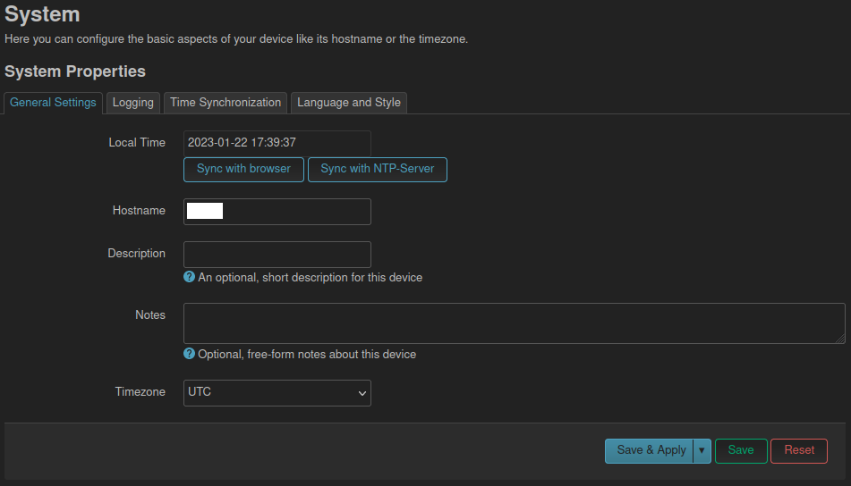
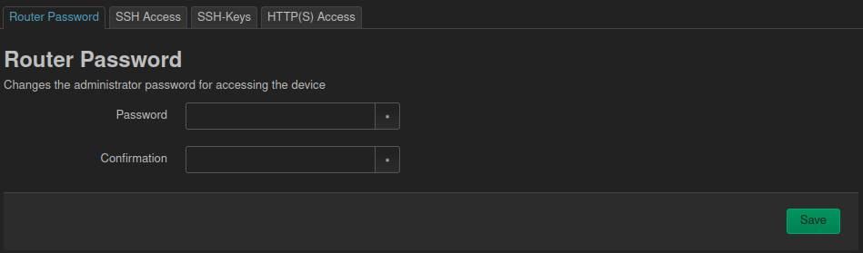
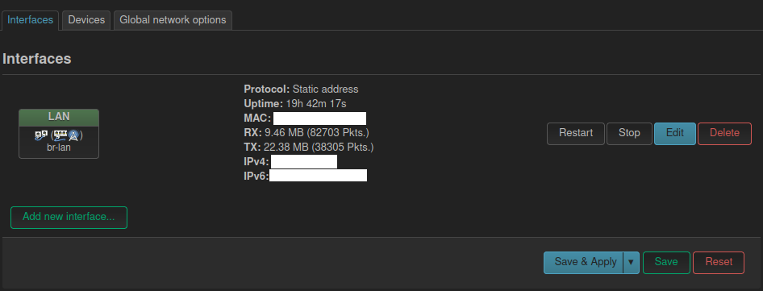
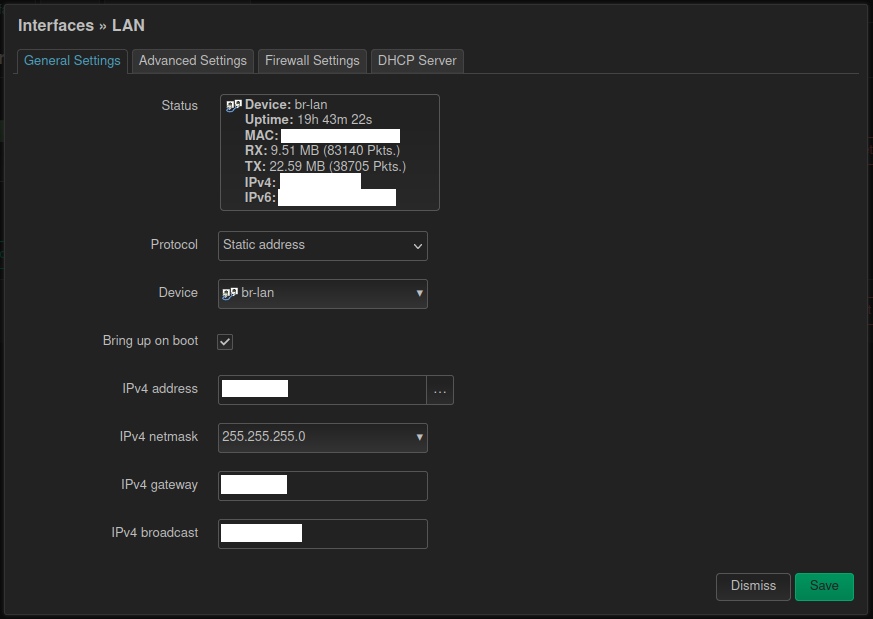
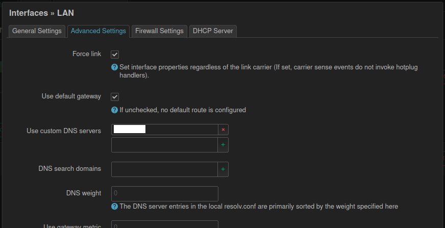
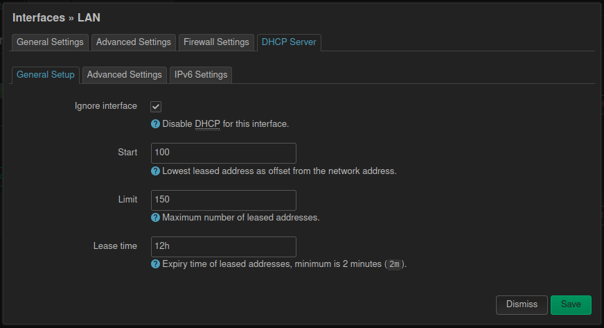
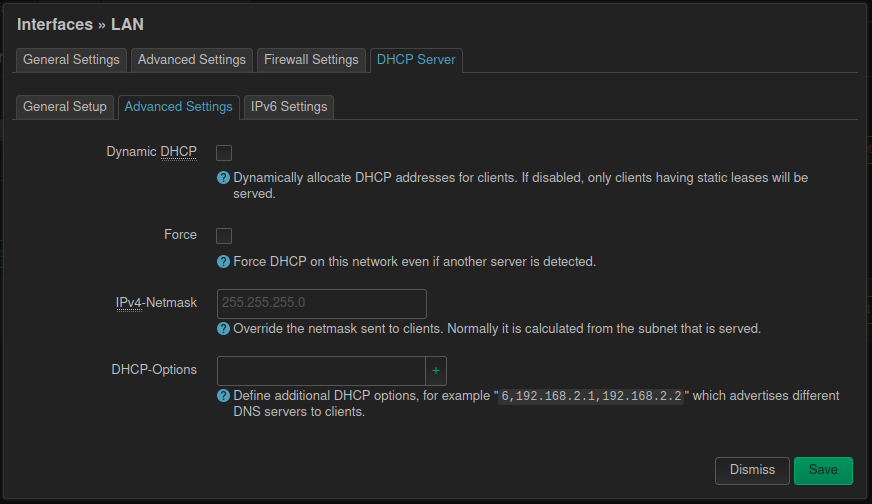
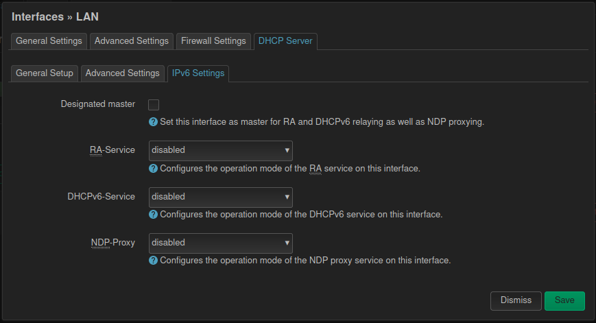
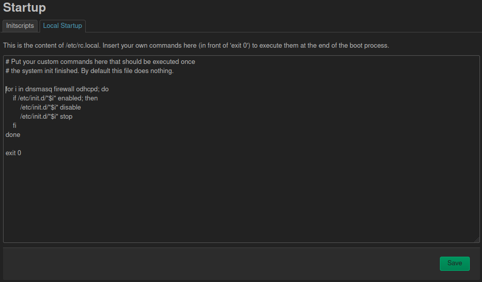

Ubiquiti EdgeRouter X
---------------------

* https://www.amazon.ca/Ubiquiti-ER-X-UBIQUITI-Router-Black/dp/B0144R449W
* http://sector5d.org/openwrt-on-the-ubiquiti-edgerouter-x.html
* http://www.makikiweb.com/ipv6/edgerouterx_openwrt.html
* https://www.reddit.com/r/openwrt/comments/x1grtz/proscons_of_openwrt_on_ubiquiti_edgerouter_x
* https://www.reddit.com/r/openwrt/comments/nejwp6/openwrt_on_edgerouterx_advantage
* https://openwrt.org/toh/ubiquiti/edgerouter_x_er-x_ka
* https://openwrt.org/inbox/toh/ubiquiti/ubiquiti_edgerouter_x_er-x_ka
* https://openwrt.org/docs/techref/hardware/switch
* https://firmware-selector.openwrt.org/?version=22.03.5&target=ramips%2Fmt7621&id=ubnt_edgerouter-x
* https://github.com/darkxst/erx-migration  needed if upgrading an ERX from pre-24.10.x OpenWRT (see below)

(New method) Steps for replacement of stock firmware::

    To install on stock firmware, install the OpenWRT 22.03 factory firmware image
    from web UI or cli, reboot, then ssh in and directly run the migration scripts
    from that. You dont need to sysupgrade to the full 22.03 image. Now that 24.10
    has been released I suppose the wiki page should be updated. Basically step 3
    on the wiki page (https://openwrt.org/toh/ubiquiti/edgerouter_x_er-x_ka) should
    continue onto the migration instructions.

(Old method) Steps for replacement of stock firmware::

    # Prepare your machine to talk to the stock UI and OpenWRT
    # Use eth0 if still on stock firmware and eth1 if on OpenWRT
    ip addr add 192.168.1.99/24 broadcast + dev enp0s25

    # Backup any flash partitions you think you might need
    ssh ubnt@192.168.1.1
    sudo su
    mount -o remount,size=240M tmpfs /tmp
    cat /proc/mtd > /tmp/proc_mtd.txt
    dd if=/dev/mtd2ro of=/tmp/dev_mtd2.img
    dd if=/dev/mtd3ro of=/tmp/dev_mtd3.img
    dd if=/dev/mtd4ro of=/tmp/dev_mtd4.img
    dd if=/dev/mtd5ro of=/tmp/dev_mtd5.img
    dd if=/dev/mtd6ro of=/tmp/dev_mtd6.img

    # Get an interim factory image onto the unit and flash it
    scp openwrt-ramips-mt7621-ubnt-erx-initramfs-factory.tar ubnt@192.168.1.1:/tmp
    ssh ubnt@192.168.1.1
    add system image /tmp/openwrt-ramips-mt7621-ubnt-erx-initramfs-factory.tar

    # Upgrade from the older OpenWRT factory image to the newest OpenWRT
    scp -O openwrt-22.03.3-ramips-mt7621-ubnt_edgerouter-x-squashfs-sysupgrade.bin root@192.168.1.1:/tmp
    ssh -oHostKeyAlgorithms=+ssh-rsa root@192.168.1.1
    sysupgrade -F -n /tmp/openwrt-22.03.3-ramips-mt7621-ubnt_edgerouter-x-squashfs-sysupgrade.bin

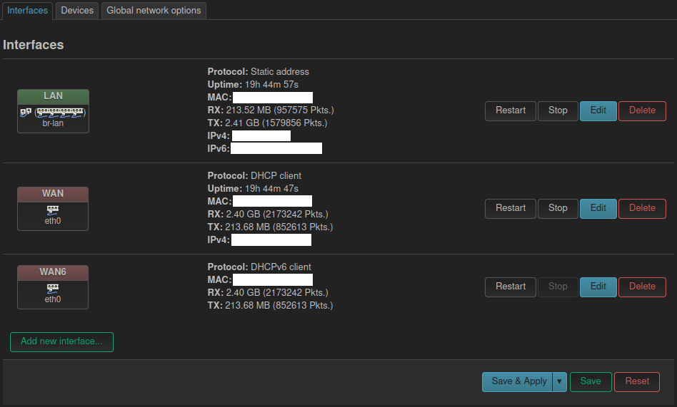
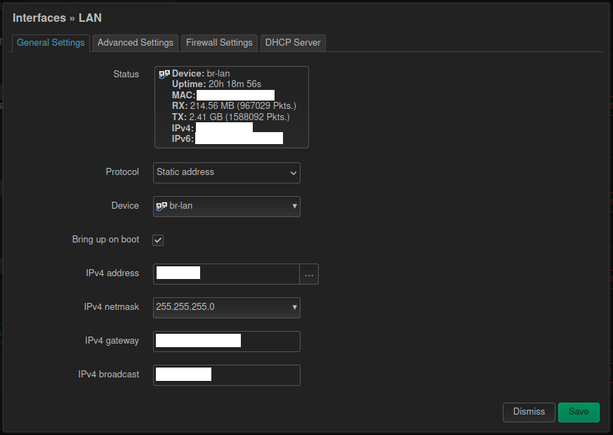
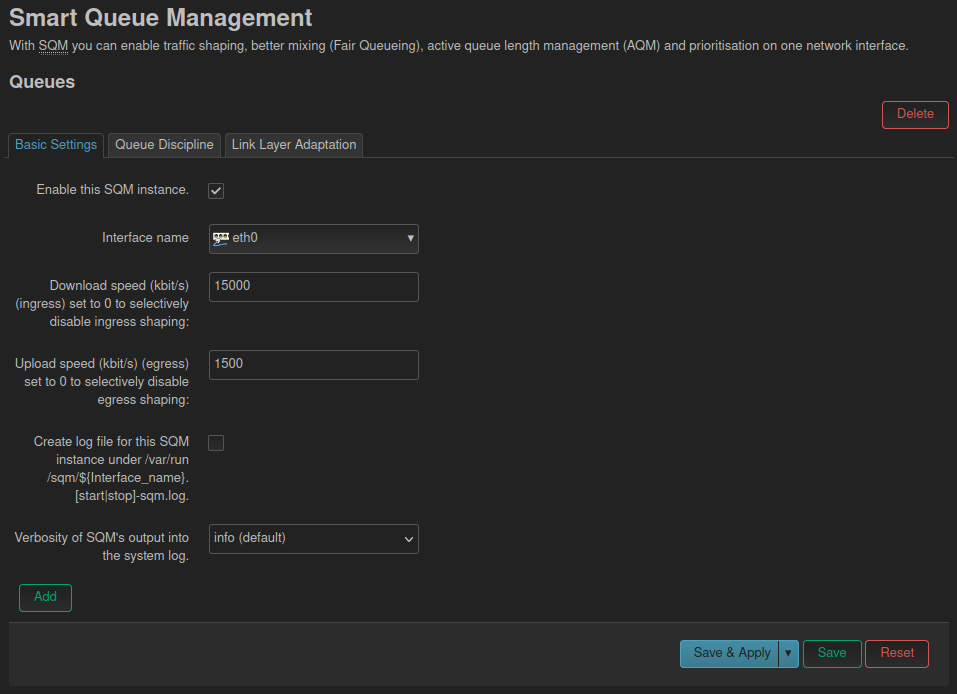
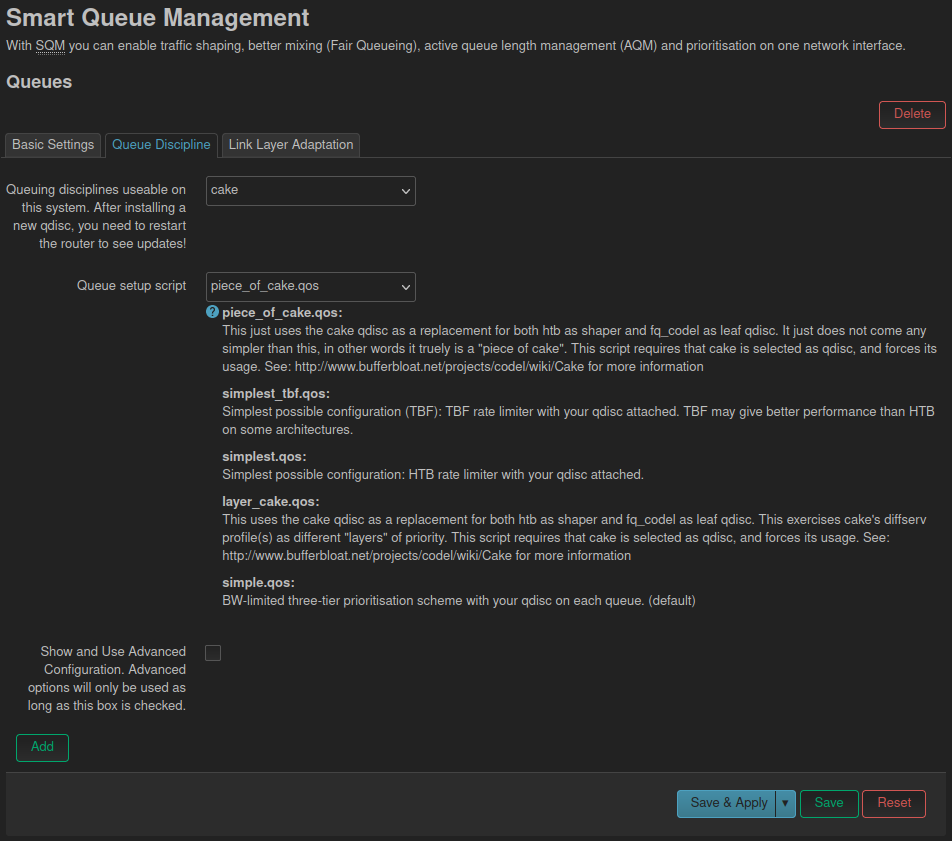

Configuration thingies::

    System -> System          :  Set hostname
    System -> Administration  :  Set password
    Network -> Interfaces     :  Interfaces -> LAN -> Edit button

QoS setup::

    System -> Software                    :  Install package "luci-app-sqm"
    Network -> SQM QoS -> Basic Settings  :  Download and upload speeds (in kbit/s)
                                          :    [30000 kbit/s download speed]
                                          :    [3000 kbit/s upload speed]
                                          :  Enable this SQM instance checked
                                          :  Interface name (eth0 => wan, wan6)

Other::

    System -> DHCP and DNS -> Static Leases  :  Set some statically-assigned entries
    System -> DHCP and DNS -> Hostnames      :  Set some backup fixed hostnames for IPv4

OpenWRT
-------

* https://openwisp.io  manage lots of OpenWRT devices from a web UI?
* https://libe.net/en/wlan-practice

::

    opkg update

    opkg list-upgradable | cut -f 1 -d ' ' | xargs -r opkg upgrade

    opkg list-upgradable | cut -f 1 -d ' ' | while IFS='$\n' read -r line; do opkg install $line ; done

Other
-----

* https://r.obin.ch/blog/2022/08/05/set-up-wireguard-on-openwrt
* https://github.com/benjojo/dumb-net-poller  Go utility to scrape /proc for network statistics for Grafana
* https://blog.brixit.nl/making-a-linux-managed-network-switch  DIY managed Gigabit Ethernet switch
* https://blog.benjojo.co.uk/post/sn2010-linux-hacking-switchdev  another fancy whitebox switch
* https://interfacinglinux.com/2024/12/26/banana-pi-bpi-r4-openwrt-quickstart  dual-10GbE SFP

Bell
----

* https://reddit.com/r/bell/comments/1hgh32v/what_are_my_options_to_use_my_own_router_instead
* https://www.store.mikrotikcanada.ca/ethernet-routers/441-rb5009ugsin-4752224007148.html?SubmitCurrency=1&id_currency=3  (mandatory "www" here)
* https://mikrotik.com/product/rb5009ug_s_in
* https://mikrotik.com/product/rb5009_mount  K-79
* https://openwrt.org/toh/mikrotik/rb5009ug_s_in?s[]=18
* https://github.com/adron-s/openwrt-rb5009
* https://downloads.openwrt.org/releases/24.10.4/targets/mvebu/cortexa72  mikrotik_rb5009
* https://reddit.com/r/bell/comments/1o8zhj5/switched_from_bell_to_ebox_a_year_ago_same_fibre  ebox.ca?
* https://reddit.com/r/homelab/comments/wjd2ps/canadian_isp_with_whom_i_can_use_my_own_router
* https://reddit.com/r/homelab/comments/wjd2ps/comment/ijhs6mu  use your own modem and router
* https://reddit.com/r/bell/comments/18sdfzy/are_you_technically_savvy_and_want_to_bypass_your
* https://morey.tech/technical%20blog/Bell-HomeHub-4000-PPPoE-with-pfSense

::

    You will need to know if your service is gpon or xgs-pon.
