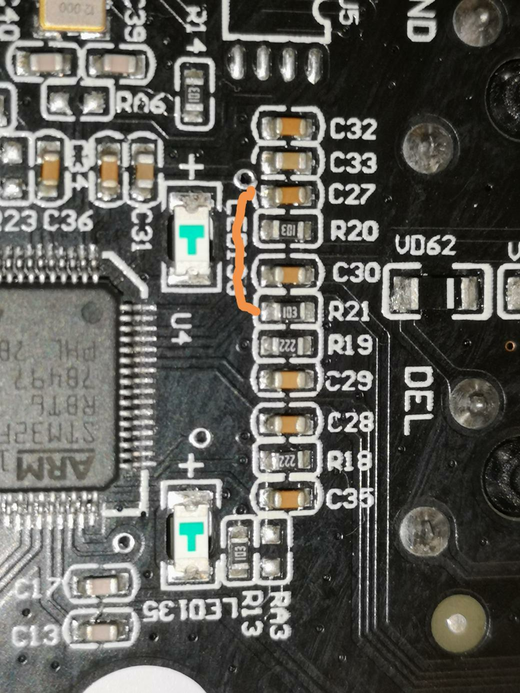

Durgod Taurus K320/K310 Non-Backlit Keyboards
=============================================

These are some very nice, economical mechanical keyboards with Cherry MX
switches (Black, Blue, Brown, Clear, Red, Silent Red, Speed Silver, White) that
can run the 100% open-source QMK keyboard firmware.

Product Pages
-------------

* https://www.durgod.com/page9?_l=en&product_id=47
* https://www.durgod.com/page9?_l=en&product_id=53

Reviews
-------

* https://www.techpowerup.com/review/durgod-taurus-320-tkl-keyboard/
* https://aphnetworks.com/index.php/reviews/durgod-taurus-k320
* https://switchandclick.com/2020/11/02/durgod-k320-review/
* https://tlrtechnology.com/2019/07/09/durgod-taurus-k320-tkl-review-can-it-really-be-this-good/
* https://www.reddit.com/r/MechanicalKeyboards/comments/7t70fr/review_durgod_taurus_k320_tenkeyless_keyboard/
* https://www.rtings.com/keyboard/reviews/durgod/taurus-k320
* https://www.youtube.com/watch?v=17rISRgJO1o
* https://www.youtube.com/watch?v=D_S30mEkggQ
* https://www.youtube.com/watch?v=dSXrde3sJpc
* https://www.youtube.com/watch?v=JDkkMzMGIm0

Where To Buy
------------

* https://www.aliexpress.com/item/32845509908.html?spm=a2g0o.productlist.0.0.4d8c6c1ab0jr7z
* https://www.aliexpress.com/item/32852709021.html?spm=a2g0o.productlist.0.0.9e8769bbcJn9gR
* https://kprepublic.com/products/durgod-87-taurus-k320-mechanical-keyboard-using-cherry-mx-switches-pbt-doubleshot-keycaps-brown-blue-black-red-silver-switch?_pos=4&_sid=bda219a06&_ss=r
* https://kprepublic.com/products/durgod-104-taurus-k310-mechanical-keyboard-using-cherry-mx-switches-pbt-doubleshot-keycaps-brown-blue-black-red-silver-switch?_pos=3&_sid=bda219a06&_ss=r
* https://www.amazon.ca/DURGOD-Mechanical-Keyboard-Switches-Interface/dp/B078H3WPHM
* https://www.amazon.ca/Durgod-Taurus-K310-Mechanical-Keyboard/dp/B07V1SQYB8
* https://www.durgodkeyboard.com/product/durgod-87-taurus-k320-mechanical-keyboard-using-cherry-mx-switches-pbt-doubleshot-keycaps-brown-blue-black-red-silver-switch/
* https://www.durgodkeyboard.com/product/durgod-104-taurus-k310-mechanical-keyboard-using-cherry-mx-switches-pbt-doubleshot-keycaps-brown-blue-black-red-silver-switch/

Disassembly
-----------

You must open the keyboard once to boot the keyboard into "DFU mode" for
initial flashing of QMK.  Once QMK is installed on the keyboard, you may boot
it into "DFU mode" whenever you like by holding down the "ESC" key while
plugging-in the keyboard (at power up).

Follow this video to open the keyboard but use a dozen or so guitar picks
instead of a nasty metal screwdriver.

* https://www.youtube.com/watch?v=H-HN3f20aLI
* https://duckduckgo.com/?t=ffab&q=guitar+pick+punch&iax=images&ia=images

Weird Button Inside
~~~~~~~~~~~~~~~~~~~

There is a weird button inside but nobody seems sure of what it does yet.  It
joins the "D2" pin (#54) to the "VSS" pin (#63).

* https://www.techpowerup.com/review/durgod-taurus-320-tkl-keyboard/4.html
* https://www.reddit.com/r/MechanicalKeyboards/comments/bvmlfi/bricked_my_durgod_k320_taurus_after_firmware/

Force DFU Boot
~~~~~~~~~~~~~~

Short R21 to C27 ("BOOT0" to "VDD" pin) and apply power (plug the USB into some orifice).

QMK Firmware
------------

QMK build "0.11.54" or newer includes the mainline-merged K320 code.
K310 support is going to be merged "real soon now" (tm).

* https://github.com/qmk/qmk_configurator/pull/887  for the K320
* https://github.com/qmk/qmk_firmware/pulls?q=is%3Apr+durgod+is%3Aopen
* https://github.com/qmk/qmk_firmware/pulls?q=is%3Apr+durgod+is%3Aclosed
* https://github.com/qmk/qmk_firmware/issues?q=is%3Aissue+durgod+is%3Aopen
* https://github.com/qmk/qmk_firmware/issues?q=is%3Aissue+durgod+is%3Aclosed
* https://github.com/the-via/keyboards/pull/588  for the K320
* https://www.reddit.com/r/MechanicalKeyboards/comments/i0pfwv/first_qmk_powered_durgod_k320/
* https://coreysalzano.com/how-to/customizing-a-durgod-keyboard-for-macos/

Building New Firmware
---------------------

::

    pip install qmk
    qmk setup

    qmk compile -kb durgod/k320 -km typhon
    qmk compile -kb durgod/k310 -km chimera

    mv durgod_k3x0_k320_base_typhon.bin qmk_${QMK_VERSION}_durgod_k3x0_k320_base_typhon.bin
    mv durgod_k3x0_k310_base_chimera.bin qmk_${QMK_VERSION}_durgod_k3x0_k310_base_chimera.bin

Flashing New Firmware
---------------------

Confirm the keyboard is in DFU mode and find out what's inside the box::

    $ dfu-util --list
    dfu-util 0.9

    Copyright 2005-2009 Weston Schmidt, Harald Welte and OpenMoko Inc.
    Copyright 2010-2016 Tormod Volden and Stefan Schmidt
    This program is Free Software and has ABSOLUTELY NO WARRANTY
    Please report bugs to http://sourceforge.net/p/dfu-util/tickets/

    Found DFU: [0483:df11] ver=2200, devnum=61, cfg=1, intf=0, path="1-4", alt=1, name="@Option Bytes  /0x1FFFF800/01*016 e", serial="FFFFFFFEFFFF"
    Found DFU: [0483:df11] ver=2200, devnum=61, cfg=1, intf=0, path="1-4", alt=0, name="@Internal Flash  /0x08000000/064*0002Kg", serial="FFFFFFFEFFFF"

WARNING:  If you see no "Found DFU" lines, your keyboard is not in DFU mode.

Download a firmware from the keyboard to a file::

    $ dfu-util --upload foo.bin --alt 0 --dfuse-address 0x08000000
    dfu-util 0.9

    Copyright 2005-2009 Weston Schmidt, Harald Welte and OpenMoko Inc.
    Copyright 2010-2016 Tormod Volden and Stefan Schmidt
    This program is Free Software and has ABSOLUTELY NO WARRANTY
    Please report bugs to http://sourceforge.net/p/dfu-util/tickets/

    Opening DFU capable USB device...
    ID 0483:df11
    Run-time device DFU version 011a
    Claiming USB DFU Interface...
    Setting Alternate Setting #0 ...
    Determining device status: state = dfuIDLE, status = 0
    dfuIDLE, continuing
    DFU mode device DFU version 011a
    Device returned transfer size 2048
    DfuSe interface name: "Internal Flash  "
    Limiting upload to end of memory segment, 131072 bytes
    Upload	[=========================] 100%       131072 bytes
    Upload done.

Upload a firmware from a file to the keyboard::

    $ dfu-util --download qmk_durgod_k320_default.bin --alt 0 --dfuse-address 0x08000000
    dfu-util 0.9

    Copyright 2005-2009 Weston Schmidt, Harald Welte and OpenMoko Inc.
    Copyright 2010-2016 Tormod Volden and Stefan Schmidt
    This program is Free Software and has ABSOLUTELY NO WARRANTY
    Please report bugs to http://sourceforge.net/p/dfu-util/tickets/

    Match vendor ID from file: 0483
    Match product ID from file: df11
    Opening DFU capable USB device...
    ID 0483:df11
    Run-time device DFU version 011a
    Claiming USB DFU Interface...
    Setting Alternate Setting #0 ...
    Determining device status: state = dfuIDLE, status = 0
    dfuIDLE, continuing
    DFU mode device DFU version 011a
    Device returned transfer size 2048
    DfuSe interface name: "Internal Flash  "
    Downloading to address = 0x08000000, size = 22336
    Download	[=========================] 100%        22336 bytes
    Download done.
    File downloaded successfully

* https://ardupilot.org/dev/docs/using-DFU-to-load-bootloader.html

Modifications
-------------

Mill-max sockets can apparently be added to just about any PCB.

* https://www.reddit.com/r/MechanicalKeyboards/comments/kv65fe/first_mech_durgod_taurus_k320_tkl_with_blank/giwkpvq/?utm_source=share&utm_medium=web2x&context=3
* https://github.com/mattdibi/redox-keyboard/commit/f21b8012429fc5535975bc3ffa8748a3036dd564#diff-182f2658e98d80c37485c41da5065c6f07d49c259d26e8b7e331d4d9f2e124fb
* https://www.reddit.com/r/MechanicalKeyboards/comments/8tuell/these_millmax_hotswap_sockets_are_so_good/
* https://keyboardlube.com/products/mill-max-sockets
* https://www.reddit.com/r/MechanicalKeyboards/comments/cbykxw/millmax_socket_guide_pxlnght/
* https://www.digikey.ca/en/products/detail/mill-max-manufacturing-corp/0305-2-15-80-47-80-10-0/2639493
* https://www.mouser.ca/ProductDetail/mill-max/0305-2-15-80-47-80-10-0/?qs=QtQX4uD3c2Uys0ai6Tr8NQ==

Wireless/Alternate Firmwares
----------------------------

* https://keebfol.io/
* https://zmkfirmware.dev/
* https://github.com/zmkfirmware/zmk
* https://github.com/KMKfw/kmk_firmware

Nifty Adapters
--------------

* https://yaowei.dev/posts/usb-to-usb-converter/
* https://geekhack.org/index.php?topic=80421.0

Rubber Ducks
------------

* https://github.com/coder12341/pico-ducky
* https://pythonawesome.com/turn-your-raspberry-pi-pico-into-a-usb-rubber-ducky/
